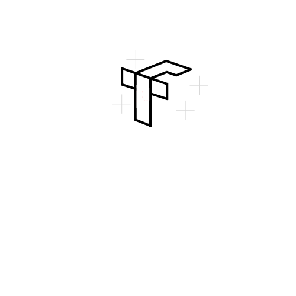

<p align="center" style="margin: 0 0 1px 0;">
  
</p>

<h1 align="center" style="margin: 0 0 10px 0;">
  <span style="color:#FF7A18;">Tensor</span><span style="color:#1F6FEB;">Foundry</span>
</h1>

<p align="center">
  <strong>An opinionated open-source platform for engineered AI agents</strong><br/>
  Build, orchestrate, observe, and evaluate agentic workflows — not chatbots.
</p>

<p align="center">
  <!-- Project status badges -->
  
  
  
  
</p>

---

## Project status

**TensorFoundry is in active development.**

- Core abstractions and APIs are stabilising
- Logging, orchestration, and evaluation are production-oriented
- Expect **breaking changes** before the first stable release (`v1.0.0`)

This project is being built **in the open** with correctness, observability, and long-term maintainability as first-class goals.

If you’re evaluating TensorFoundry today:
- ✅ Suitable for experimentation and internal tools
- ⚠️ Not yet recommended for mission-critical production without pinning versions

---

## What is TensorFoundry?

**TensorFoundry** is an opinionated framework for building **agentic systems as engineered software**, not prompt demos.

It is designed for teams who care about:
- **execution**, not demos
- **observability**, not guesswork
- **evaluation**, not vibes

Agents in TensorFoundry are **stateful systems** with tools, retries, failure handling, and measurable outcomes.

---

## What makes TensorFoundry different

Most agent frameworks optimise for prompts and single-run success.

TensorFoundry optimises for:

- **Execution** — tools, state, retries, failure handling
- **Orchestration** — planner → executor → critic patterns
- **Observability** — structured traces as first-class artefacts
- **Evaluation** — task-based scoring and regression detection
- **Provider flexibility** — OpenAI, Anthropic, Gemini, local models

If an agent can’t be logged, validated, and compared over time, it’s not production-ready.

---

## What’s included (v1 scope)

### Agent templates
- **ResearchAgent** — structured research with tools and synthesis
- **DecisionAgent** — decision memos with assumptions and trade-offs
- **RefactorAgent** — safe, deterministic code refactoring (dry-run by default)

### Orchestration
- Planner → Executor → Critic pattern
- Explicit retry logic with state mutation

### Logging & observability
- Canonical JSONL logging schema
- Safe-by-default payload sanitisation
- Trace validation (`validate`)
- Human-readable inspection (`inspect`)
- Trace diffing (`diff`)

### Evaluation
- Task-based evaluation harness
- Suite definitions in JSON
- Result summaries and pass rates
- Regression detection via diffing

### Quality & CI
- Tests covering orchestration, logging, and evaluation
- CI enforcing schema correctness and evaluation success

---

## Quickstart (5 minutes)

```bash
git clone https://github.com/<your-username>/tensorfoundry.git
cd tensorfoundry

python -m venv .venv
source .venv/bin/activate
pip install -e ".[dev]"
```
Run a research agent:

```bash
python examples/quick_research_agent.py
```

Validate and inspect the trace:

```bash
python -m tensorfoundry.logging.validate logs/$(ls -t logs | head -n 1)
python -m tensorfoundry.logging.inspect logs/$(ls -t logs | head -n 1)
```

Run evaluation suites:

```bash
python -m tensorfoundry.evaluation.run src/tensorfoundry/evaluation/suites/quickstart.json
python -m tensorfoundry.evaluation.run src/tensorfoundry/evaluation/suites/research_quickstart.json
```

## Core ideas

- Agents ≠ chatbots
- Logs are the dataset
- Evaluation > clever prompts
- Orchestration is the product

See manifesto.md for the full philosophy and roadmap.md for what’s coming next.

## Repository layout

```text
src/tensorfoundry/
├── agents/          # Agent templates
├── orchestration/   # Planner–Executor–Critic patterns
├── logging/         # Schema, emitter, validate, inspect, diff
├── evaluation/      # Harness, suites, results diff
├── examples/        # Runnable examples
└── docs/            # Design notes
```
# Branching & releases
- prod — protected, stable release branch
- dev — integration branch for ongoing work
